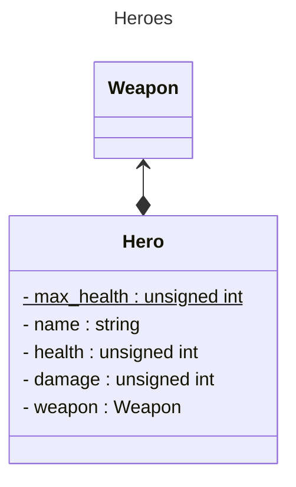

```mermaid
---
title: Heroes
---
classDiagram

    Weapon <--* Hero

    class Hero {
        - max_health : unsigned int$
        - name : string
        - health : unsigned int
        - damage : unsigned int
        - weapon : Weapon
    }
```

