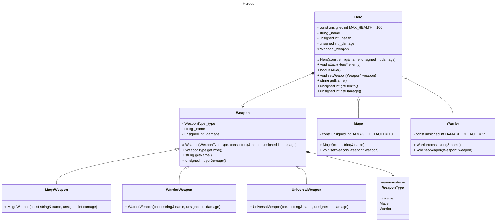

```mermaid
---
title: Heroes
---
classDiagram   
    class WeaponType {
        <<enumeration>>
        Universal
        Mage
        Warrior
    }
    
    class Weapon {
        - WeaponType _type
        - string _name
        - unsigned int _damage
        # Weapon(WeaponType type, const string& name, unsigned int damage)
        + WeaponType getType()
        + string getName()
        + unsigned int getDamage()
    }
    
    class MageWeapon {
        + MageWeapon(const string& name, unsigned int damage)
    }
    
    class WarriorWeapon {
        + WarriorWeapon(const string& name, unsigned int damage)
    }
    
    class UniversalWeapon {
        + UniversalWeapon(const string& name, unsigned int damage)
    }
    
    class Hero {
        - const unsigned int MAX_HEALTH = 100
        - string _name
        - unsigned int _health
        - unsigned int _damage
        # Weapon _weapon
        # Hero(const string& name, unsigned int damage)
        
        + void attack(Hero* enemy)
        + bool isAlive()
        + void setWeapon(Weapon* weapon)
        
        + string getName()
        + unsigned int getHealth()
        + unsigned int getDamage()
    }
    
    class Mage {
        - const unsigned int DAMAGE_DEFAULT = 10
        
        + Mage(const string& name)
        
        + void setWeapon(Weapon* weapon)
    }
    
    class Warrior {
        - const unsigned int DAMAGE_DEFAULT = 15
        
        + Warrior(const string& name)
        
        + void setWeapon(Weapon* weapon)
    }
    
    %% Наследование для оружия
    Weapon <|-- MageWeapon
    Weapon <|-- WarriorWeapon
    Weapon <|-- UniversalWeapon
    
    %% Наследование для героев
    Hero <|-- Mage
    Hero <|-- Warrior
    
    %% Зависимости (использование enum)
    Weapon *--> WeaponType 
    Hero *--> Weapon
```

